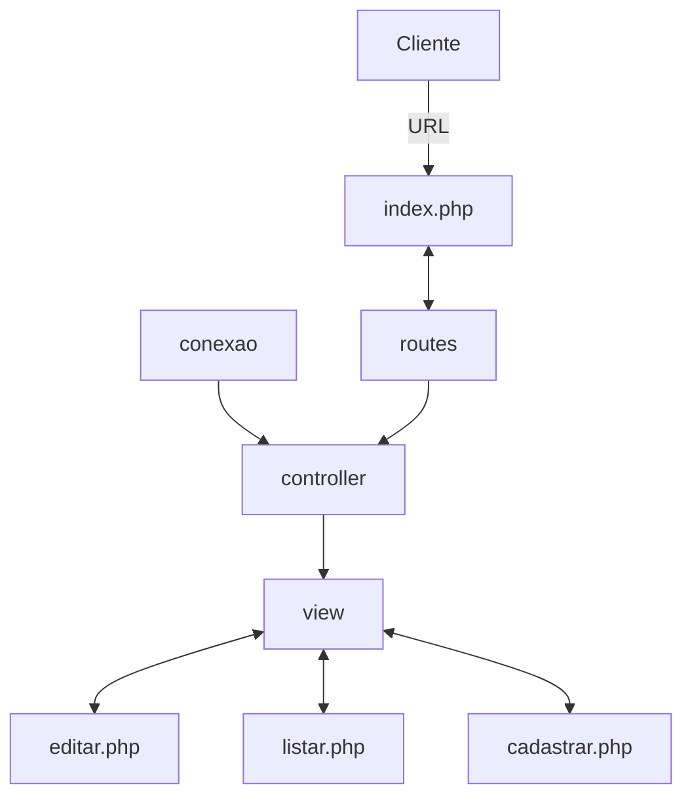
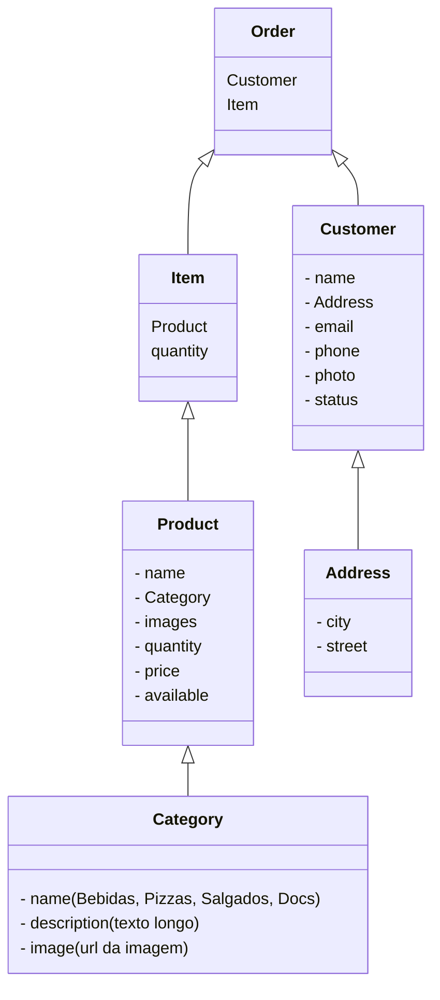

# Gerenciamento do Sistema de Merendas



## Estrutura inicial das classes/tabelas



## Como instalar

- passo 1: Faca o clone do projeto

```bash
git clone git@github.com:digitalcollege-classes/php-merenda.git
```

> Voce pode preferir executar apenas um comando para facilitar e nao necessitar dos outros passos.

Entre no diretorio e execute:

```shell
make setup
```

- passo 2: Executar o projeto

```
docker compose up -d
```

- passo 3: Entre no container do PHP

```shell 
docker ps

docker exec -it <id> bash
```

- passo 4: Instalar as depedencias (dentro do container)

```shell
composer install
```

- passo 5: Criar o esquema do banco de dados

```shell
php bin/doctrine orm:schema-tool:update --force
```


## Como Contribuir

- Passo 1: Faca o clone do repositorio
```bash
git clone git@github.com:digitalcollege-classes/php-merenda.git
```


- passo 2: Voltar pro seu branch principal
```bash
git checkout main
```

- passo 3: Atualizar seu branch principal
```bash
git pull origin main
```

- passo 4: Criar um novo ramo/branch
```bash
git checkout -b nome-da-branch
```

- passo 5: Faz o que tem que fazer

- passo 6: Commitar as mudancas feitas


